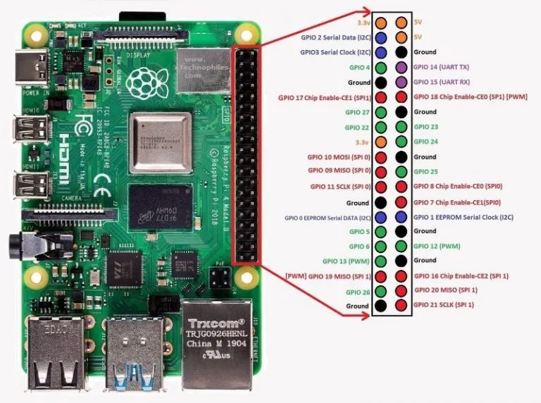
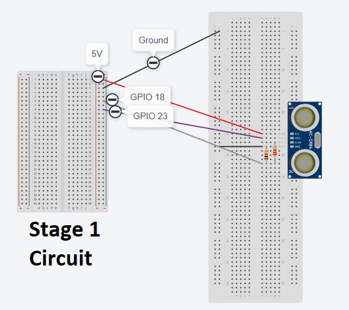

## Distance sensor program

### To create the circuit, you will need a Raspberry Pi, breadboard, 4 male to female jumper wires, 1 male to male jumper wire, a distance sensor, one 1 k ohm resistor, and one 220 ohm resistor.

Using the GPIO diagram below, attach the components and wires as shown in the Stage 1 Circuit image. Be sure the Raspberry Pi is powered down while you set up the circuit to avoid damaging the Pi or components. Verify the circuit is set up correctly before turning on the Pi. For this example, the breadboard on the left simulates the Raspberry Pi GPIO pins.





Power on the Pi and open Thonny or other Python IDE. Use the code below to activate the distance sensor and begin measuring distances.

```python
from gpiozero import DistanceSensor
import time

sensor = DistanceSensor(echo=18, trigger=23, max_distance=15.0)

while True:
    distance = sensor.distance * 100
    print("Nearest object: %.1f" % distance)
    time.sleep(1)
```

Running the program will print the distances to the display.
