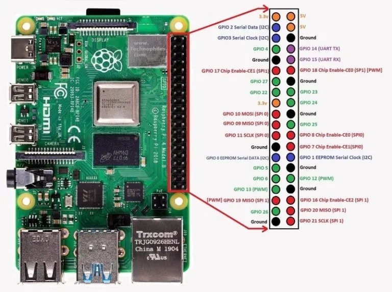
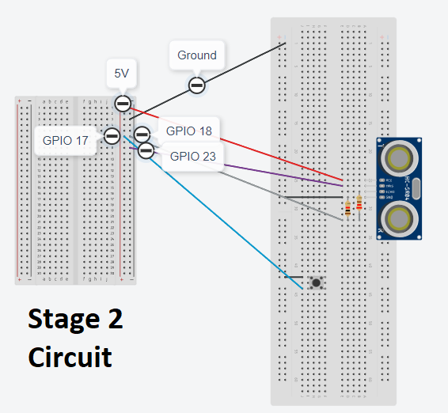

## Button-activated distance sensor program

### In addition to the components used in Stage 1, you will need a button, 1 male to female jumper wire, and 1 male to male jumper wire.

Using the GPIO diagram below, add the button and wires as shown in the Stage 2 Circuit image. Be sure the Raspberry Pi is powered down while you set up the circuit to avoid damaging the Pi or components. Verify the circuit is set up correctly before turning on the Pi. For this example, the breadboard on the left simulates the Raspberry Pi GPIO pins.





Power on the Pi and open Thonny or other Python IDE. Use the code below to activate the distance sensor and begin measuring distances.

```python
from gpiozero import Button
from gpiozero import DistanceSensor
import time

button = Button(17)
sensor = DistanceSensor(echo=18, trigger=23, max_distance=15.0)

while True:
    button.wait_for_press()
    button.wait_for_release()

    while button.is_pressed != True:
        time.sleep(1)

        distance = sensor.distance * 100
        print("Nearest object: %.1f" % distance)
        
        
        if button.is_pressed:
            break

    button.wait_for_release()
```

Push the button to start the program. It will print the distances to the display. Push the button again to shut the distance sensor off.
