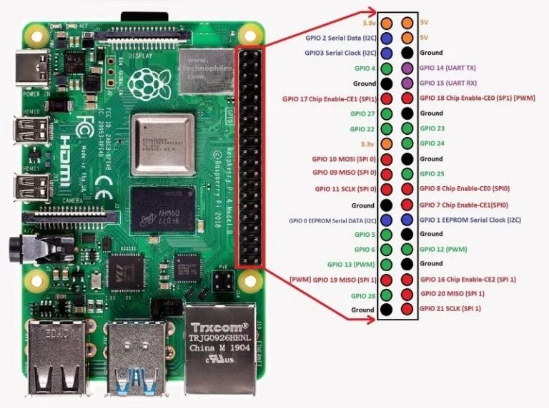

## Button-activated distance sensor program with LED alerts

### In addition to the components used in Stages 1 and 2, you will need 2 x LEDs (red and green), 2 x 220 ohm resistors, 2 male to female jumper wires, and 2 male to male jumper wires.

Using the GPIO diagram below, add the LEDs and wires as shown in the Stage 3 Circuit image. Be sure the Raspberry Pi is powered down while you set up the circuit to avoid damaging the Pi or components. Verify the circuit is set up correctly before turning on the Pi. For this example, the breadboard on the left simulates the Raspberry Pi GPIO pins.




Power on the Pi and open Thonny or other Python IDE. Use the code below to activate the distance sensor, measure distances, and trigger the LED alerts.

```python
from gpiozero import PWMLED
from gpiozero import Button
from gpiozero import DistanceSensor
import time

red = PWMLED(4)
green = PWMLED(25)
button = Button(17)
sensor = DistanceSensor(echo=18, trigger=23, max_distance=15.0)

while True:
    button.wait_for_press()
    button.wait_for_release()

    while button.is_pressed != True:
        time.sleep(1)

        distance = sensor.distance * 100
        print("Nearest object: %.1f" % distance)
            
        if distance <= 5.0:
            green.off()
            red.pulse()
        
        elif distance > 5.0:
            red.off()
            green.pulse()
        
        if button.is_pressed:
            green.off()
            red.off()
            break

    button.wait_for_release()
```

Push the button to start the program. It will print the distances to the display and trigger the green light if the nearest object is over 5 cm away, and red if the distance is 5 cm or less. Push the button again to shut the distance sensor off.

Check out the video to see how it works.

